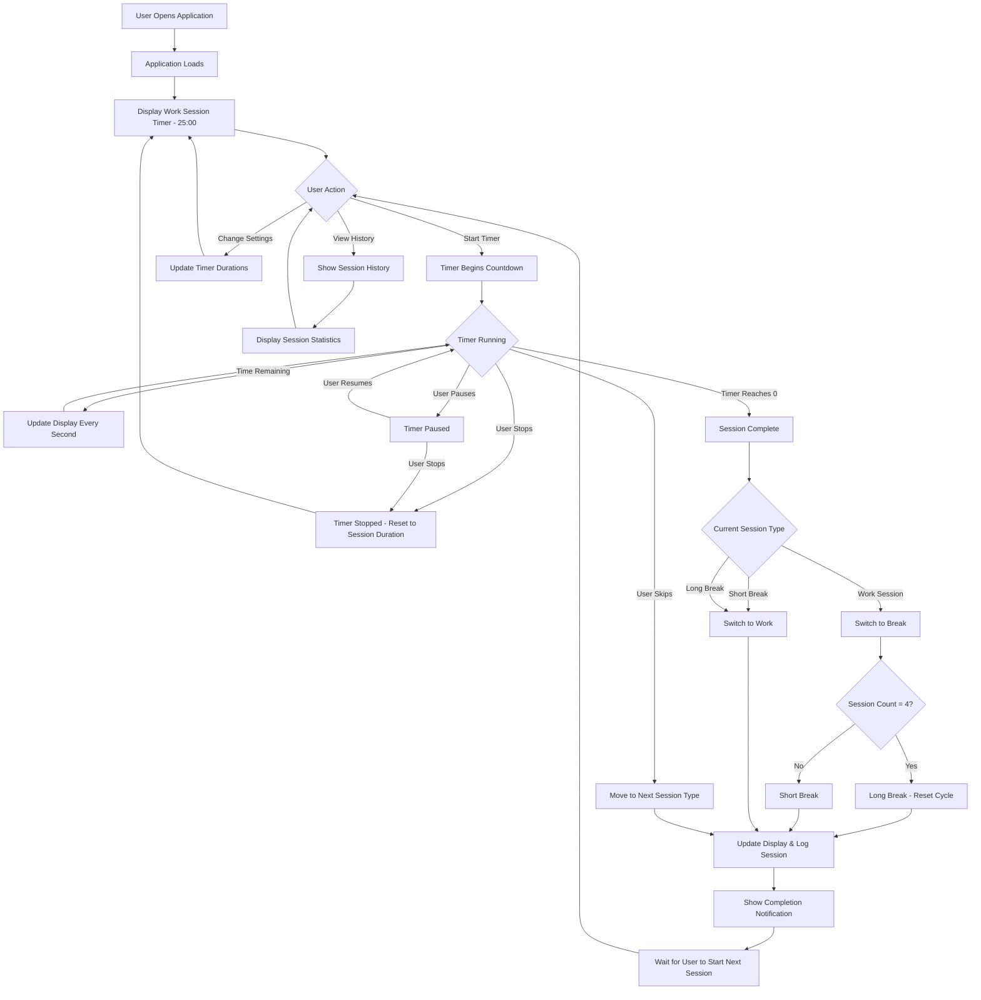
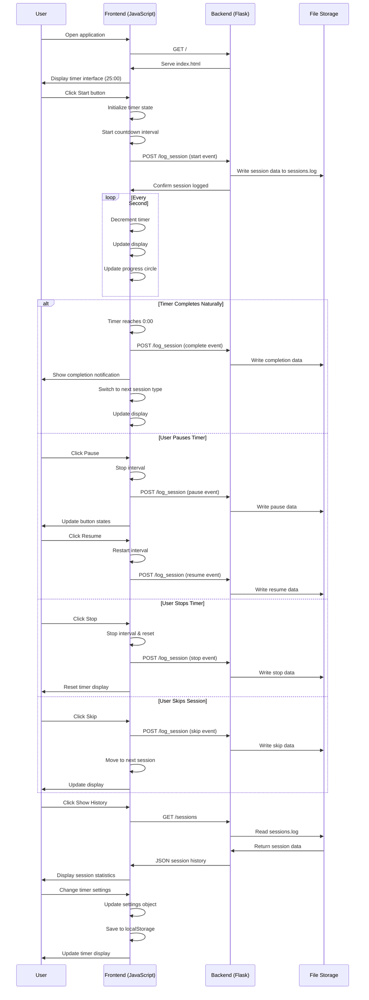

# Pomodoro Timer Application Documentation

## Overview

The Pomodoro Timer is a web-based productivity application that implements the Pomodoro Technique. It helps users manage their time by breaking work into focused intervals (traditionally 25 minutes) separated by short breaks, with longer breaks after every 4 work sessions.

## Application Architecture

### Technology Stack
- **Backend**: Python Flask
- **Frontend**: HTML5, CSS3, Vanilla JavaScript
- **Data Storage**: JSON file-based logging
- **Styling**: CSS with gradient themes and responsive design

### Key Components

1. **Flask Backend (`app.py`)**
   - Serves the main application
   - Handles session logging via REST API
   - Manages static file serving
   - Provides session history retrieval

2. **Frontend Interface (`templates/index.html`)**
   - Single-page application structure
   - Timer display with circular progress indicator
   - Control buttons and settings panel
   - Session history and statistics

3. **Client-Side Logic (`static/script.js`)**
   - PomodoroTimer class managing all timer functionality
   - Session state management
   - API communication with backend
   - Local storage for user preferences

4. **Styling (`static/style.css`)**
   - Responsive design with gradient backgrounds
   - Animated progress indicators
   - Theme switching based on session type

## Core Features

### Timer Functionality
- **Work Sessions**: 25 minutes (configurable)
- **Short Breaks**: 5 minutes (configurable)
- **Long Breaks**: 15 minutes (configurable to 30 minutes)
- **Cycle Management**: 4 work sessions before long break
- **Visual Progress**: Circular progress indicator
- **Audio/Visual Notifications**: Session completion alerts

### Session Management
- Start, pause, stop, and skip session controls
- Automatic progression through work and break cycles
- Session state persistence during browser tab switches
- Real-time timer countdown display

### Data Tracking
- Session logging to backend
- Session history with timestamps
- Statistics tracking (total sessions, completed sessions, total time)
- Local storage for user preferences

### User Interface
- Responsive design for desktop and mobile
- Dynamic themes based on current session type
- Collapsible session history panel
- Configurable timer durations

## User Flow Diagram



## Application Sequence Diagram



## API Endpoints

### Backend Routes

| Endpoint | Method | Purpose | Request Body | Response |
|----------|---------|---------|--------------|----------|
| `/` | GET | Serve main application | None | HTML page |
| `/static/<filename>` | GET | Serve static assets | None | Static files |
| `/log_session` | POST | Log session events | Session data JSON | Success/error status |
| `/sessions` | GET | Retrieve session history | None | Array of session objects |

### Session Data Structure

```json
{
  "session_type": "work|short-break|long-break",
  "action": "start|pause|resume|stop|skip|complete",
  "timestamp": "ISO 8601 datetime string",
  "duration": "seconds (number)",
  "cycle_count": "current cycle number",
  "session_count": "current session in cycle"
}
```

## State Management

### Timer States
- **Ready**: Initial state, timer not started
- **Running**: Timer actively counting down
- **Paused**: Timer stopped but can be resumed
- **Stopped**: Timer reset to session duration
- **Complete**: Session finished, ready for next session

### Session Types
- **Work**: Focused work period (default 25 minutes)
- **Short Break**: Brief rest between work sessions (default 5 minutes)
- **Long Break**: Extended rest after 4 work sessions (default 15 minutes)

### Cycle Management
- **Cycle Count**: Tracks completed cycles (4 work sessions + 1 long break)
- **Session Count**: Tracks position within current cycle (1-4)
- **Auto-progression**: Automatically moves between session types

## File Structure

```
pomodoro-app/
├── app.py                 # Flask backend application
├── requirements.txt       # Python dependencies
├── sessions.log          # Session data storage (JSON)
├── static/
│   ├── script.js         # Frontend JavaScript logic
│   └── style.css         # Application styling
└── templates/
    └── index.html        # Main HTML template
```

## Data Flow

1. **User Interaction**: User interacts with timer controls
2. **State Update**: JavaScript updates internal timer state
3. **Display Update**: UI reflects current state and time remaining
4. **Backend Logging**: Session events sent to Flask backend
5. **File Storage**: Session data persisted to JSON log file
6. **History Retrieval**: Frontend requests and displays historical data

## Local Storage

The application uses browser localStorage for:
- Timer duration preferences
- User configuration settings
- Session type preferences

## Browser Compatibility

- **Notifications**: Requires user permission for desktop notifications
- **Visibility API**: Handles tab switching detection
- **Local Storage**: Persists user preferences between sessions
- **Fetch API**: Modern browser requirement for backend communication

## Error Handling

### Frontend Error Handling
- Network request failures are logged but don't stop timer operation
- Missing DOM elements are handled gracefully
- Timer continues operation even if backend logging fails

### Backend Error Handling
- Invalid session data returns 400 Bad Request
- Missing required fields are validated
- File I/O errors are caught and logged
- Empty or corrupted session files are handled

## Performance Considerations

- **Timer Precision**: 1-second intervals for UI updates
- **Network Efficiency**: Minimal API calls only for session events
- **Memory Management**: Proper cleanup of intervals and event listeners
- **File I/O**: Efficient JSON file operations for session storage

## Future Enhancement Opportunities

- **User Authentication**: Multi-user session tracking
- **Cloud Storage**: Backend database integration
- **Advanced Statistics**: Detailed productivity analytics
- **Customizable Themes**: User-selectable color schemes
- **Sound Notifications**: Configurable audio alerts
- **Mobile App**: Native mobile application version
- **Team Features**: Shared pomodoro sessions
- **Integration**: Calendar and task management system connections

## Development Setup

1. Install Python dependencies: `uv pip install -r requirements.txt`
2. Run Flask application: `python app.py`
3. Access application at: `http://localhost:5000`
4. Session data stored in: `sessions.log` file

## Testing Strategy

### Manual Testing Areas
- Timer accuracy and display updates
- Session transition logic
- Button state management
- Local storage persistence
- Backend API functionality
- Responsive design across devices

### Automated Testing Opportunities
- Unit tests for timer logic
- API endpoint testing
- Session data validation
- Cross-browser compatibility testing